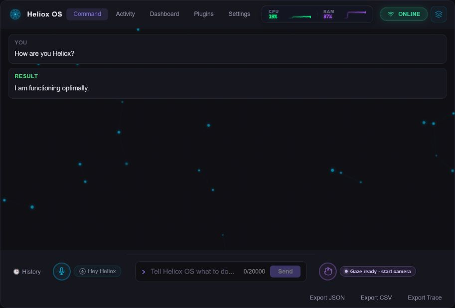
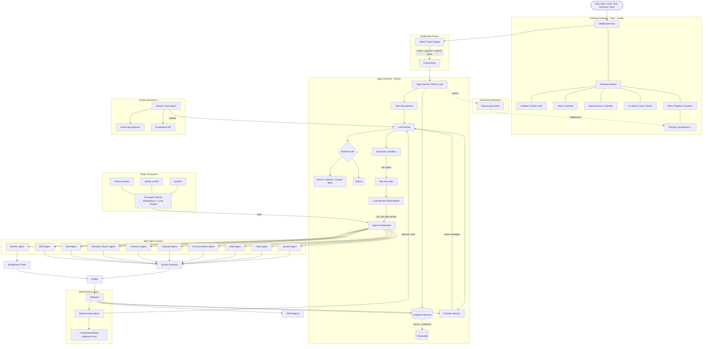

# Heliox OS — AI System Control Agent

<p align="center">
  <a href="https://gssoc.girlscript.org/"></a>
  <a href="https://github.com/VyomKulshrestha/Heliox-OS/releases"></a>
  <a href="https://github.com/VyomKulshrestha/Heliox-OS/releases"></a>
  <a href="https://github.com/VyomKulshrestha/Heliox-OS/actions/workflows/release.yml"></a>
  <a href="https://github.com/VyomKulshrestha/Heliox-OS/actions/workflows/ci.yml"></a>
  <a href="https://github.com/VyomKulshrestha/Heliox-OS/issues?q=is%3Aissue+is%3Aopen+label%3A%22good+first+issue%22"></a>
  <a href="LICENSE"></a>
  
</p>

<p align="center">
  
</p>

<p align="center">
  <strong>Control your entire computer with natural language, voice, and hand gestures.</strong><br>
  An open-source, privacy-first AI agent that plans, executes, and verifies complex multi-step tasks.
</p>

<p align="center">
  🌐 <b><a href="https://helioxos.dev">Visit the Official Website (helioxos.dev)</a></b> 🌐
</p>

<p align="center">
  <a href="#installation">Installation</a> •
  <a href="#jarvis-autonomy">JARVIS Mode</a> •
  <a href="#action-catalog">Actions</a> •
  <a href="#architecture">Architecture</a> •
  <a href="#security">Security</a> •
  <a href="#troubleshooting">Troubleshooting</a> •
  <a href="CONTRIBUTING.md">Contributing</a>
</p>

---
## 🌱 New Contributor Onboarding

New to open source? New to Heliox OS? Start here.

This guide helps first-time contributors understand the project structure, set up the development environment, and make their first contribution.

### What is Heliox OS?

Heliox OS is an AI-powered operating system agent that combines planning, execution, verification, memory, and security into a unified multi-agent system.

### Before Contributing

We recommend:

1. Reading this README completely
2. Reading CONTRIBUTING.md
3. Understanding the project structure
4. Running the project locally
5. Exploring beginner-friendly issues

### Project Structure Overview

```text
heliox-os/
├── daemon/          Python agent runtime and tests
├── tauri-app/       Tauri desktop shell and Svelte UI
├── plugins/         Reviewed marketplace packages and catalog
├── schemas/         Shared validation schemas
├── scripts/         Validation and release utilities
└── docs/            Operational and contributor guides
```

## Why Heliox OS?

Unlike simple command runners, Heliox OS is a **true agentic system** inspired by robust autonomous architectures like OpenClaw, running a continuous ReAct loop with a **modular multi-agent orchestrator**:

1. **Gateway Hub & Memory** — LLM evaluates persistent memory context before reasoning.
2. **Planner** — Converts natural language into a structured multi-step action plan.
3. **Agent Orchestrator** — Routes each action to one of ten specialist roles with source-scoped capability policy.
4. **Specialist Agents** — Ten domain experts execute through native OS APIs where available, plus explicit browser and input-automation adapters when the task requires them.
5. **Verifier** — Post-execution verification confirms the action succeeded and feeds results back into the loop.
6. **Reflector** — Self-improvement engine learns from successes and failures.
7. **Security** — Five-tier permission system with confirmation gates and rollback support.

<a id="jarvis-autonomy"></a>
## 🤖 JARVIS Autonomy (v0.9.0)

Heliox OS combines reactive commands with opt-in proactive and background capabilities that run through the same permission and verification pipeline:

- 🧠 **Adaptive Proactive Suggestions**: Pattern-matches local screen context and surfaces visible, optional help before you ask. Accept/dismiss feedback persists on-device, tunes each pattern's timing and priority, and temporarily suppresses repeatedly rejected suggestions. Acceptance still enters the guarded autonomous permission and verification pipeline.
- 🤝 **Interactive Execution Companion**: Independently reviews proposed plans, can warn, revise, or stop work that drifts from the request, accepts typed or spoken corrections while a task is running, and offers grounded next ideas after verified results.
- ⚡ **Fire-and-Forget Autonomous Jobs**: Spawn complex multi-step background tasks that decompose, execute, and verify completely independent of the UI or main event loop.
- 👁️ **Always-On Screen Awareness**: Automatically bootstrapped computer vision that tracks your contextual state cross-platform, natively bridging exactly what you see into the LLM planner. 
- 🎤 **Continuous Voice Listener**: Real-time push-free 'Hey Heliox' ambient wake-word dispatch for frictionless task execution. Endpoints on natural speech start/silence (VAD) instead of a fixed recording window, and supports barge-in — start talking and Heliox stops mid-sentence to listen, instead of talking over you.
- 🤚 **30+ Hand Gestures & Air Drawing**: Control your PC via webcam with static poses (Palm, Pinch) and motion gestures (Two-Finger Swipe). A lightweight kinematic prediction layer smooths tracking and reduces misfires. An opt-in 3D world-model backend (`vision.mediapipe_backend: "tasks"`) adds real-metric-scale depth via MediaPipe's `HandLandmarker` — see [GESTURES.md](GESTURES.md#3d-world-model-layer-mediapipe-tasks). An opt-in coarse gaze-tracking modality (`vision.gaze_tracking_enabled`) fuses screen-region gaze with voice + gesture on-device — see [GESTURES.md](GESTURES.md#gaze-tracking-third-input-modality).
- 🖱️ **Gesture Cursor Control** *(off by default)*: Point to move the real OS cursor, pinch to click — opt in via Settings. Open palm always exits instantly.
- 🎯 **Adaptive Voice & Gesture Calibration** *(on by default)*: A lightweight on-device continual-learning loop personalizes pinch/thumb thresholds and wake-word matching from implicit usage signals — no retraining, no new prompts, bounded and resettable in Settings.
- 🌀 **Arc Reactor UI & Ambient HUD**: Animated, immersive Tauri overlays responding contextually to system actions.

## 🧠 Cognitive Engine Integrations

Heliox OS integrates a lightweight, dependency-free **Cognitive Engine** (`pilot.cognitive.cognitive_engine`) directly into the operating logic. Attention/stress/load are explicitly labelled behavioural estimates derived from measured local keyboard, click, pointer, interaction-history, and opt-in gaze signals. The HUD reports confidence and never presents these estimates as medical or physiological measurements. No raw keystrokes, click targets, camera frames, or gaze images are stored or sent to a model:

1. **Cognitive HUD:** Shows smoothed attention/stress/load estimates together with signal count and confidence, avoiding false “100% certain” states when evidence is sparse.
2. **Dynamic TTS Stress-Pacing:** JARVIS automatically slows down voice generation if you are engaged in high cognitive-load tasks.
3. **Stress-Aware Destructive Gate:** High-risk actions (e.g., recursive deletes) evaluate cognitive stress first. If you are distracted, a strict 10-second auditory confirmation gate holds the process.
4. **Subconscious Persona Fingerprint:** The Subconscious background loop learns your cognitive engagement patterns and encodes them to `persona.md` to align UIs to your habits.
5. **Attention-Optimized Notifications:** The notification pipeline dynamically buffers trivial background alerts until the system detects a low-load resting state.
6. **ReAct Cognitive Cost Estimator:** Tasks predict aggregate cognitive demand proactively. If executing a plan risks exceeding mental bandwidth, JARVIS pauses.
7. **JARVIS Intent Classifier:** Fully integrated native intent fusion classifying spoken commands against current workload intensity.

## Experimental Cognitive Library APIs

The repository also contains seven experimental cognitive modules exposed
through `CognitiveHub`. The daemon initializes this hub, but these examples are
currently developer-facing APIs rather than independently validated,
user-visible product features. The production execution path uses the
lightweight Cognitive Engine integrations listed above.

### 1. Adaptive Biometric Learning Loop
Track opt-in behavioural patterns over weeks (time-of-day productivity and interaction cadence). Create personalized behavioural fingerprints that estimate useful interaction times. This is an experimental developer API, not a physiological or medical classifier.

```python
from pilot.cognitive.biometric_loop import BiometricLearningLoop

loop = BiometricLearningLoop(user_id="user")
loop.record_cognitive_sample(attention=0.7, stress=0.3, load=0.5)
recommendation = loop.get_interaction_recommendation()
print(recommendation.recommended, recommendation.interaction_type)
```

### 2. Ambient Intelligence Mode
Instead of reactive commands, Heliox proactively suggests actions based on predicted cognitive state. Example: *"You've been on this task for 2 hours with increasing stress — want me to schedule a break?"*

```python
from pilot.cognitive.ambient_intelligence import AmbientIntelligenceEngine

ambient = AmbientIntelligenceEngine(biometric_loop)
await ambient.update_cognitive_state(attention=0.8, stress=0.6, load=0.7)
# Automatically generates proactive suggestions based on trends
```

### 3. Multi-Modal Neural Bridge
Extend beyond screen vision — integrate webcam eye-tracking, audio tone analysis, keyboard/mouse dynamics. Build a unified "neural workspace" that predicts what the user will need before they ask.

```python
from pilot.cognitive.neural_bridge import NeuralBridge

bridge = NeuralBridge()
bridge.record_keystroke()
bridge.record_mouse_move(x, y)
workspace = bridge.compute_workspace()
print(workspace.cognitive_state, workspace.predicted_need)
```

### 4. Cognitive Offloading
When load > 80%, automatically surface "memory anchors" — key info from recent actions. Let Heliox absorb cognitive burden by remembering complex multi-step workflows.

```python
from pilot.cognitive.cognitive_offload import CognitiveOffloader

offloader = CognitiveOffloader()
offloader.update_load(0.85)  # Triggers offload surface
surface = offloader.get_offload_surface()
print(surface["anchors"], surface["workflows"])
```

### 5. Evolving Persona Architecture
Move from static persona.md to a living "neural avatar" that changes daily based on cognitive patterns. The AI's communication style adapts: concise when stressed, detailed when relaxed.

```python
from pilot.cognitive.evolving_persona import EvolvingPersonaEngine

persona = EvolvingPersonaEngine(user_id="user")
persona.record_interaction(attention=0.7, stress=0.3, load=0.5)
greeting = persona.get_greeting()  # "Good afternoon! Ready to tackle anything?"
print(persona.get_ui_config())  # Adapts UI based on state
```

### 6. Local Cognitive Handoff Prototype
The handoff engine can capture cognitive context, register device sessions, and suggest moving a task to another device. Its current `CloudStore` implementation is a local JSON-backed prototype under `~/.cache/heliox/cloud`; it does **not** upload data to a hosted synchronization service.

```python
from pilot.cognitive.cognitive_handoff import CognitiveHandoffEngine

handoff = CognitiveHandoffEngine(device_name="desktop")
handoff.capture_snapshot(attention=0.8, stress=0.6, load=0.7)
suggestion = handoff.get_handoff_suggestion(load=0.85, stress=0.3)
```

### 7. Model-Adapter Architecture
The cognitive pipeline exposes a model-agnostic adapter interface. It ships with a heuristic fallback; additional adapters must be registered by the host application before they can be selected.

```python
from pilot.cognitive.quantum_cognitive import create_pipeline, QuantumCognitivePipeline

pipeline = create_pipeline()
output = await pipeline.predict("user working on complex task")
print(output.attention_score, output.stress_level, output.cognitive_load)

# A host can register and select another adapter at runtime.
```

### Unified Cognitive Hub

All features are wrapped in a single interface:

```python
from pilot.cognitive.hub import CognitiveHub

hub = CognitiveHub()
state = await hub.analyze("user is coding")

# All features accessible
print(f"Attention: {state.attention}, Stress: {state.stress}")
print(f"Optimal: {state.optimal_interaction}")
print(f"Overloaded: {state.is_overloaded}")
print(hub.get_greeting())  # Adaptive greeting
print(hub.get_offload_surface())  # Memory anchors
```

### Model-Agnostic by Design

The **QuantumCognitivePipeline** ships with a heuristic adapter by default and supports registering additional model adapters at runtime:

```
Available Models:
  - Heuristic Fallback (fallback)
    Available: True
    Capabilities: LOAD_ESTIMATION
    Avg Latency: ~1ms
```

Additional adapters can be registered via `pipeline.register_adapter(...)` and switched with `pipeline.set_active_model(...)` without changing any call site.

---

## 🧠 Multi-Agent Orchestrator

Heliox OS uses a **modular multi-agent architecture** where specialized agents collaborate to solve complex tasks:

| Agent | Domain | Key Skills |
|-------|--------|------------|
| 🖥️ **System Agent** | OS Operations | Files, processes, services, power, input control, screen vision, triggers |
| 💻 **Code Agent** | Development | Code generation, execution, debugging, dev tooling (git, pip, npm) |
| 🌐 **Web Agent** | Web & APIs | Browser automation, scraping, HTTP requests, downloads |
| 📊 **Monitor Agent** | Monitoring | CPU, RAM, disk, network monitoring with threshold alerts |
| 📡 **Communication Agent** | Messaging | Email, Slack, Discord, webhooks, desktop notifications |
| 📅 **Calendar Agent** | Scheduling | .ics parsing, CalDAV sync, event management |
| 🔎 **Forensics Agent** | Security | Log parsing, incident reporting, threat containment, PID translation |
| 🔐 **SSH Agent** | Remote systems | Allowlisted hosts, commands, and scripts |
| 📰 **RSS Agent** | Feeds | Feed retrieval and release/news summaries |
| 🔍 **Semantic Search Agent** | Retrieval | Workspace indexing and semantic search |

**How it works:** The Planner generates an action plan → the Orchestrator analyzes each action type → routes to the correct specialist → agents execute in sequence → results merge for verification.

**Dynamic Spawning:** Agents can be created on-demand at runtime via the `agent_spawn` API endpoint.

## Release Verification

The release gate is reproducible; it does not rely on an informal task-pass percentage. The latest local v0.9.0 readiness pass completed:

| Surface | Verification |
|---------|--------------|
| Python daemon | Ruff lint and format; 1,167 tests passed, 6 skipped |
| Svelte UI | Prettier and `svelte-check` with zero warnings; 102 unit tests; production build |
| Dependencies | `npm audit --audit-level=high` with zero vulnerabilities |
| Native Tauri bridge | Cargo format, Clippy with warnings denied, and 6 Rust tests |
| Visual UI | 32 Playwright visual scenarios passed on Windows |

GitHub Actions repeats Python tests on Windows, Ubuntu, and macOS with Python 3.11 and 3.12, runs the frontend gate, compares per-OS visual baselines, and checks the Rust bridge on Linux. Camera, microphone, desktop permissions, model downloads, and OS-specific integrations still require real-device validation; CI cannot prove hardware behavior.

## 🖥️ Cross-Platform Support

| Platform | Status |
|----------|--------|
| Windows 10/11 | Primary development and hardware-validation platform |
| Ubuntu / Debian | Python/UI CI coverage; desktop packages and integrations vary |
| macOS | Python/UI CI coverage; permissions and hardware must be validated locally |
| Fedora / Arch | Source installation; package-manager actions use dnf/pacman |

<a id="action-catalog"></a>
## Action Catalog

The planner schema currently declares **146 action types**. Availability depends on the operating system, installed optional dependencies, configured credentials, and the active security policy. The groups below are representative, not exhaustive; `daemon/pilot/actions.py` is the source of truth.

### File Operations
`file_read` · `file_write` · `file_delete` · `file_move` · `file_copy` · `file_list` · `file_search` · `directory_summary` · `file_permissions`

### Process Management
`process_list` · `process_kill` · `process_info`

### Shell Execution
`shell_command` · `shell_script` (multi-line bash/powershell/python)

### Code Execution
`code_execute` — Run Python, PowerShell, Bash, or JavaScript with auto-fix on failure

### Browser & Web
`browser_navigate` · `browser_extract` · `browser_extract_table` · `browser_extract_links`

### Screen & Vision
`screenshot` · `screen_ocr` · `screen_analyze`

### Package Management
`package_install` · `package_remove` · `package_update` · `package_search`
Auto-detects: winget, choco, brew, apt, dnf, pacman

### System Information
`system_info` · `cpu_usage` · `memory_usage` · `disk_usage` · `network_info` · `battery_info`

### Window Management
`window_list` · `window_focus` · `window_close` · `window_minimize` · `window_maximize`

### Audio / Volume
`volume_get` · `volume_set` · `volume_mute`

### Display / Screen
`brightness_get` · `brightness_set` · `screenshot`

### Power Management
`power_shutdown` · `power_restart` · `power_sleep` · `power_lock` · `power_logout`

### Network / WiFi
`wifi_list` · `wifi_connect` · `wifi_disconnect`

### Clipboard
`clipboard_read` · `clipboard_write`

### Scheduled Tasks & Triggers
`schedule_create` · `schedule_list` · `schedule_delete` · `trigger_create`

### Environment Variables
`env_get` · `env_set` · `env_list`

### Downloads
`download_file`

### Service Management (Linux)
`service_start` · `service_stop` · `service_restart` · `service_enable` · `service_disable` · `service_status`

### GNOME / Desktop (Linux)
`gnome_setting_read` · `gnome_setting_write` · `dbus_call`

### Windows Registry
`registry_read` · `registry_write`

### Open / Launch / Notify
`open_url` · `open_application` · `notify`

## Architecture



## Runtime Subsystems

These are implemented runtime paths, not a future roadmap:

| Subsystem | Runtime surface |
|-----------|-----------------|
| Persistent memory and reflection | `memory/store.py`, `agents/reflector.py`, prompt/skill registries |
| Planning and orchestration | Dependency-aware decomposition and 10 specialist-agent roles |
| Reasoning telemetry | Live ReAct events rendered in the desktop UI |
| Screen, hand, and gaze perception | Screen context plus on-device MediaPipe hand and coarse gaze pipelines |
| Learned risk world model | A trained MLP predicts action impact beside deterministic safety rules; it can only increase caution |
| Durable voice/gesture workflows | SQLite-backed multi-step jobs with pause, resume, cancel, and restart recovery |
| Opt-in autonomous controls | Healing, execution narration, preview-before-action, manual supervision, and gesture cursor |
| Voice output | Local Kyutai Pocket TTS with automatic OS-native fallback |
| Extension ecosystem | Signed local plugins and a reviewed, hash-verified GitHub marketplace |

### 🔧 Task Decomposition Engine

Complex goals are automatically broken into dependency-aware subtask trees:

```
User: "Build a Flask API for todo list"
 → 1. [system] Create project folder
 → 2. [system] Install Flask            (depends: 1)
 → 3. [code]   Generate API code         (depends: 1)
 → 4. [code]   Create requirements.txt   (depends: 2)
 → 5. [code]   Run tests                 (depends: 3, 4)
```

### 🛡️ Simulation Sandbox

Before executing dangerous commands, the sandbox produces an **impact report**:

```
⚠️ Simulation Report:
  Risk: HIGH
  Impact: 154 files affected (wildcard)
  Warnings:
    - ⚠️ Plan contains destructive actions
    - 🔐 Plan requires elevated privileges
    - ♻️ 2 action(s) are NOT reversible
  Recommendation: ⚠️ HIGH RISK — Confirm impact
```

### 🧬 Self-Improving Prompt System

Successful reasoning chains are stored and reused:
- Keyword-indexed prompt templates with success/failure rates
- Automatic strategy matching for similar future tasks
- Rolling improvement — the agent gets better over time

### 🔌 Plugin Ecosystem

Heliox has two deliberately separate extension paths:

| Path | Current packages | Trust model |
|------|------------------|-------------|
| Built-in daemon integrations | Developer tools, media control, Home Assistant | Shipped and reviewed with the application |
| Public marketplace | `weather`, `spotify-control`, `home-assistant` | Approved GitHub catalog, restricted imports, per-file SHA-256 verification |

Local development plugins live in `~/.config/heliox-os/plugins/`. They are
auto-discovered at startup only after Ed25519 signature verification. Local
packages can include `plugin.ed25519.pub` with `plugin.ed25519.sig`; unsigned,
untrusted, or tampered packages are rejected before their manifest or code is
loaded.

To publish for everyone, create and test the plugin in the app, add
`plugins/<plugin-name>/manifest.json` and `plugin.py`, update
`plugins/registry.json`, run `python scripts/validate_marketplace.py --write`,
and submit a pull request. Once marketplace CI, maintainer review, and
CODEOWNER review pass and the pull request is merged to `main`, users can see
it by pressing **Refresh**. A desktop release is not required. See the
[Plugin Marketplace guide](docs/PLUGIN_MARKETPLACE.md) for the complete package
contract and moderation flow.

```json
{
  "name": "my-plugin",
  "version": "1.0.0",
  "tools": [{"name": "my_tool", "inputs": ["arg1"], "action_type": "api_call"}]
}
```

### 🧠 Subconscious Agent (Persona Learning)

A background agent that runs every 30 minutes to review the day's actions and learn user preferences:

- Clusters behavioral patterns ("always writes Python", "prefers dark mode")
- Extracts actionable rules with confidence scores
- Writes `~/.local/share/heliox-os/persona.md` and injects high-confidence rules into both typed and voice planning
- Supports manual preference setting via `persona_add_preference` API
- Categories: `preference`, `habit`, `constraint`, `style`
- Learned rules are advisory preferences only; they cannot grant permission, remove a safety warning, or override the current request

### 👁️ Screen Vision Agent

Continuous computer-vision loop that gives the agent awareness of what the user sees:

- Takes screenshots every 3 seconds by default and hashes them for change detection
- Detects the active application and window title cross-platform
- Maintains a rolling context buffer of recent screen states
- When user says "summarize this" or "close that", the planner already knows the target
- Optional LLM-powered screen description for advanced awareness

<a id="installation"></a>
## 🚀 Installation

### Option 1: Download Compiled Desktop App (Recommended)

The easiest way to get started is to download the pre-compiled installer for your operating system.

1. Go to the [GitHub Releases page](https://github.com/VyomKulshrestha/Heliox-OS/releases).
2. Download the installer for your OS:
   - **Windows**: `Heliox-OS_0.9.0_x64-setup.exe` or the `.msi`
   - **macOS (Apple Silicon)**: `Heliox-OS_0.9.0_aarch64.dmg`
   - **macOS (Intel)**: `Heliox-OS_0.9.0_x64.dmg`
   - **Linux**: `.AppImage`, `.deb`, or `.rpm`
3. Install the app.
4. Open Heliox OS and enter your API Key (e.g., Gemini, OpenAI, Claude, Meta) in the Settings tab.

The desktop app requires Python 3.11+ and starts the local daemon automatically.
On first launch it may need time to create its environment and load local models;
the UI keeps reconnecting during that initialization. Browser-only UI development
still requires a manually started daemon.
### Windows Optional-Model Troubleshooting

Kokoro TTS, Pocket TTS, and the default voice path are CPU-only; CUDA is not required. If an
optional neural dependency fails with missing runtime DLLs, install the
[Microsoft Visual C++ Redistributable](https://aka.ms/vs/17/release/vc_redist.x64.exe)
and reinstall the daemon extras from a 64-bit Python 3.11 or 3.12 environment:

```powershell
cd daemon
python -m pip install --upgrade pip setuptools wheel
python -m pip install -e ".[full,voice]"
```

Only install a CUDA-specific PyTorch build when you have deliberately enabled an
optional GPU-backed model. The core agent, learned risk model, gesture/gaze
pipeline, Kokoro TTS, and Pocket TTS do not require an NVIDIA GPU.

### Option 2: Build from Source (For Developers)

> Note: Windows contributors can use the automated `setup.ps1` script for environment setup.  
> If PowerShell blocks the script, check the Windows setup instructions in [CONTRIBUTING.md](CONTRIBUTING.md).

If you want to contribute or modify Heliox OS, build it from the source code:

**1. Install the Python daemon:**
```bash
git clone https://github.com/VyomKulshrestha/Heliox-OS.git
cd Heliox-OS/daemon
pip install -e ".[all,dev]"
```

**2. Choose your LLM:**
*   Local (Ollama): `ollama pull llama3.1:8b` -> `ollama serve`
*   Cloud (Gemini/OpenAI/Claude/Meta): Add your API key in the app GUI.

**3. Run the daemon:**
```bash
cd daemon
python -m pilot.server
```

**4. Run the frontend:**
```bash
cd tauri-app/ui
npm ci
npm run dev
```

For the native desktop shell, install the Tauri wrapper dependencies and run:

```bash
cd tauri-app
npm install
npm run tauri dev
```

## Example Commands

```
"Show me my system info"
"Take a screenshot and read the text on screen"
"Go to Wikipedia's page on AI and summarize the first 3 paragraphs"
"Create a Python project with tests and run them"
"Kill the process using the most CPU"
"Monitor my CPU and alert me when it goes above 80%"
"Download a file and show me a tree of the folder"
"List all .py files on my Desktop"
"Set my volume to 50%"
"Create a CSV with sales data and analyze it"
"What's my IP address?"
"Install Firefox"
```

<a id="security"></a>
## 🛡️ Security

> [!WARNING]
> **PLEASE READ BEFORE USE: SYSTEM COMPROMISE RISK**
> Heliox OS is an autonomous agent with the ability to execute code, delete files, and run terminal commands directly on your host operating system. While we have provided sandbox measures, the AI has real system access. **Do NOT run Heliox OS with root/Administrator privileges** unless absolutely necessary. We are not responsible for accidental data loss caused by LLM hallucinations.

- All AI outputs pass through structured schema validation before execution
- Five-tier permission system (read-only through root-level)
- Confirmation required for system-modifying and destructive actions, with **per-action granular approve/deny** — reject individual actions in a multi-step plan instead of all-or-nothing
- **Irreversibility is tracked independently of tier** — actions that can't be undone by a snapshot rollback (external emails/webhooks, SSH commands, power actions, package removal) always require confirmation, even at a lower tier, and are flagged distinctly in the approval dialog
- A secondary **LLM safety critic** independently reviews Tier 3 (destructive) and Tier 4 (root-critical) plans before the confirmation gate fires — it can block a plan outright or surface warnings alongside the approval dialog. Low-risk Tier 3 plans skip the LLM round-trip via a cheap heuristic pre-check, but the audit trail records when that happened
- Dangerous shell argument patterns (recursive+force deletes, wildcard/root path targets) are flagged even on already-whitelisted commands
- **Snapshot-based rollback** — Btrfs/Timeshift on Linux and Windows Restore Points on Windows. Required snapshots fail closed: if the selected backend is unavailable or the Windows daemon is not elevated, the destructive action does not run. Windows controls restore-point retention; Heliox retention settings apply where the backend supports them.
- **Tamper-evident, HMAC-chained audit log** for every elevated permission decision, viewable and independently verifiable (integrity check) from the Settings panel
- **Agent Gateway**: source-scoped permission floors for shell/browsing/system-control actions (interactive/autonomous/web-agent/voice/gesture/self-healing, plus one enforced ceiling per specialist agent in the multi-agent orchestrator, each tightenable but never independently widenable by a per-task override), a second tamper-evident audit chain for gateway decisions, and dry-run impact modeling extended to browser and system-control actions — see [SECURITY.md](SECURITY.md) for the full threat model this closes
- **Learned risk world model**: the bundled transition model predicts action impact from 36,000 real training samples before execution. Its MLP output is blended with an action-specific robust median calibrated on a separate temporal block and evaluated on 5,400 later held-out samples; runtime confidence falls outside the observed OS-state distribution. Deterministic policy remains authoritative, so the model can interrupt or add confirmation but cannot remove a rule-based warning or grant permission.
- **Autonomous Healing Engine (opt-in)**: passively watches CPU/memory/disk and plans a remediation goal through the normal Planner/Executor pipeline when one crosses its threshold — low-tier/reversible plans auto-execute, anything else is proposed and held for explicit confirmation — see [SECURITY.md](SECURITY.md#-autonomous-healing-engine-opt-in)
- **Pre-execution target assessment**: dry-run plans that click/type/select on the current page get checked against the live DOM before you confirm — a missing, hidden, or ambiguous target raises that action's risk and shows why, instead of the same generic description every browser action used to get — see [SECURITY.md](SECURITY.md#-pre-execution-target-assessment-browser-actions)
- **Interactive Execution Companion**: reviews every proposed plan independently, can warn/revise/stop work that drifts from the request, accepts typed or spoken live corrections during planning/execution/verification, and supplies grounded next ideas only after a verified result. Optional step narration remains user-controlled.
- **Simulate before executing (opt-in, autonomous tasks only)**: before an unattended background task commits to an action, pause and show a real screenshot with the target UI element highlighted — plus, for browser actions, a real measured before/after DOM diff from an isolated dry-run tab — and wait for you to confirm or stop; never a generated image — see [SECURITY.md](SECURITY.md#-simulate-before-executing-autonomous-background-tasks-opt-in)
- **Natural local speech**: Kokoro is the default daemon-side voice, with selectable presets, coordinated single-channel playback, and speech-start barge-in. Pocket TTS remains selectable, and both neural engines fall back to the platform voice when unavailable.
- **Mid-flight cancellation**: a Stop button in the chat panel really kills the currently in-flight command — a mid-flight shell subprocess is genuinely killed (`proc.kill()`), and PTY sessions are interrupted on demand — instead of only stopping the next action in the plan — see [SECURITY.md](SECURITY.md#-mid-flight-cancellation)
- **User Manual Supervision (opt-in)**: watches your own independent screen/keyboard/mouse activity — not anything Heliox executes — to offer cognitive coaching and warn about risky-looking content; the keyboard/mouse hook is a separate, starker opt-in gated behind a one-time "I understand" confirmation, and nothing typed or clicked is ever saved or sent anywhere, only the fact that a risk pattern matched — see [SECURITY.md](SECURITY.md#-user-manual-supervision-opt-in)
- **Gesture cursor control is off by default** — the continuous gesture-to-cursor bridge drives the real OS mouse cursor and is the one feature in this app that acts without a per-action confirmation gate, so it requires an explicit opt-in in Settings and always exits instantly on an open palm, the panel's stop button, or disabling the toggle
- **Reviewed plugin marketplace** — the app installs only catalog-approved packages, verifies every declared SHA-256 digest, signs the local installation, and routes planner-triggered plugin actions through the normal permission system
- Command whitelist with optional unrestricted mode
- **Encrypted API key storage** via platform keyring (GNOME Keyring / Windows Credential Manager)
- API keys are NEVER logged, included in plans, or sent to local LLMs

### Permission Tiers

| Tier | Level | Auto-Execute | Examples |
|------|-------|-------------|----------|
| 0 - Read Only | 🟢 | Yes | file_read, system_info, clipboard_read |
| 1 - User Write | 🟡 | Yes | file_write, clipboard_write, env_set |
| 2 - System Modify | 🟠 | Needs Confirm | package_install, service_restart, wifi_connect |
| 3 - Destructive | 🔴 | Needs Confirm | file_delete, process_kill, power_shutdown |
| 4 - Root Critical | ⛔ | Needs Confirm | root operations, disk operations |

Tier isn't the whole story: some Tier 2 actions (e.g. `api_send_email`, `ssh_command`) are flagged **irreversible** even though they're not "destructive" in the traditional sense — there's no local snapshot to roll them back with once they fire.

## Configuration

Config file: `~/.config/heliox-os/config.toml`

```toml
[model]
provider = "ollama"           # "ollama" | "cloud"
ollama_model = "llama3.1:8b"
cloud_provider = "gemini"     # "gemini" | "openai" | "claude" | "meta"

[security]
root_enabled = false
confirm_tier2 = true
unrestricted_shell = false
snapshot_on_destructive = true
snapshot_backend = "auto"

[server]
host = "127.0.0.1"
port = 8785

[proxy]
http = "http://proxy.example.com:8080"
https = "http://proxy.example.com:8080"
no_proxy = "localhost,127.0.0.1"

[vision]
camera_index = 0
mediapipe_backend = "legacy" # "tasks" enables 3D hand landmarks
gaze_tracking_enabled = false

[gesture_cursor]
enabled = false

[gateway]
enabled = true
risk_gate_enabled = true

[voice]
tts_engine = "kokoro_tts"    # natural local voice; falls back to the OS voice if unavailable

[screen_vision]
capture_interval_seconds = 3.0
```
<a id="troubleshooting"></a>
## 🛠️ Troubleshooting

### Frequently Asked Questions (FAQ)

#### Q1: The daemon fails to start — what should I check?
**A:** First, verify you are using **Python 3.11+**. Check your version with `python --version`. The desktop app starts the daemon and keeps reconnecting while first-run models initialize. If it remains offline, check `~/.local/state/heliox-os/pilot.log` and ensure port `8785` is free.

#### Q2: I get an API key error even though I entered one.
**A:** Heliox OS stores API keys securely in your system keyring (GNOME Keyring/libsecret on Linux, Credential Manager on Windows) or an encrypted `vault.enc` file. It does **not** use `.env` files. Ensure you've added the key via the Settings tab in the UI. If the issue persists, check if `libsecret-1-dev` is installed (on Linux).

#### Q3: How do I switch from Ollama to a cloud LLM?
**A:** You can change your model provider in the `~/.config/heliox-os/config.toml` file. Under the `[model]` section, set `provider = "cloud"` and specify your `cloud_provider` (e.g., `"gemini"`, `"openai"`, `"claude"`, or `"meta"`). `"meta"` talks to Meta's Muse Spark 1.1 via the Meta Model API (public preview as of July 2026) — it's OpenAI-chat-completions-compatible, so it shares the same request path as `"openai"`.

```toml
[model]
provider = "cloud"
cloud_provider = "gemini"
```

#### Q4: Voice detection isn't working on Linux.
**A:** Install the `voice` extra, ensure PortAudio is available for `sounddevice`, select the correct input in Settings, and grant microphone permission to the terminal or Heliox app. The UI keeps push-to-talk retryable after a denied permission instead of requiring a reload.

#### Q5: Hand gesture control requires a webcam — which ones are supported?
**A:** Any standard USB or integrated webcam exposed by the browser/WebView media API should work. Hand tracking uses MediaPipe Hands or MediaPipe Tasks; gaze uses MediaPipe FaceLandmarker and remains on-device. If the camera is unavailable, close other camera users, grant camera permission, and set `camera_index` under `[vision]` if the daemon-side vision path needs a non-default device. Gesture and gaze inference share the same camera stream, so enabling gaze must not suppress hand tracking.

#### Q6: Port already in use (8785 or 8786).
**A:** Heliox OS uses port `8785` for the API and `8786` for mesh networking. If these ports are occupied, you can identify and stop the conflicting process:

**Linux/macOS:**
```bash
lsof -i :8785
kill -9 <PID>
```

**Windows:**
```powershell
netstat -ano | findstr :8785
taskkill /PID <PID> /F
```

#### Q7: Frontend Not Starting.
**A:** If the UI fails to launch, try clearing the npm cache and reinstalling dependencies:

```bash
cd tauri-app/ui
npm ci
npm run dev
```

Ensure all frontend dependencies are installed successfully before starting the app.

#### Q8: Do Pocket TTS or the learned world model require CUDA?
**A:** No. Both supported paths are CPU-capable and no NVIDIA GPU is required. If an optional neural package reports missing Windows runtime DLLs, install the [Microsoft Visual C++ Redistributable](https://aka.ms/vs/17/release/vc_redist.x64.exe) and reinstall the relevant daemon extra from 64-bit Python. Only use a CUDA-specific build for an optional model you intentionally configured.

## 📖 Developer Guides & Documentation

To help newcomers and contributors navigate the Heliox-OS codebase, please refer to the following comprehensive documentation guides:

- 🔍 **[Forensics Agent Runbook](docs/FORENSICS_RUNBOOK.md)** — Learn about the autonomous threat containment pipeline, the JSON schema for forensics logs, and the Tier 3/4 Security Gate.
- ⚙️ **[Agent Development Guide](AGENT_DEVELOPMENT_GUIDE.md)** — Step-by-step instructions on designing and registering custom specialist agents.
- 💬 **[IPC Message Formats](IPC_MESSAGE_FORMATS.md)** — Detailed specification of frontend-to-daemon WebSocket payloads and schemas.
- 🎛️ **[Gesture Control Guide](GESTURES.md)** — Setup, privacy behavior, MediaPipe backends, gaze fusion, cursor control, and gesture mappings.
- 🔒 **[Security Policy](SECURITY.md)** — Overview of permission tiers, encrypted keyring stores, and snapshot rollbacks.
- ⚡ **[Cache Architecture](CACHE_IMPLEMENTATION.md)** — Internal mechanics of state storage and model response caching.

## 🤝 Contributing

We love contributions! Whether it's adding a new gesture, fixing a bug, or building a new plugin, check out our guides to get started.

1. Read our [Contributing Guide](CONTRIBUTING.md) to set up your dev environment.
2. Check the [Good First Issues](https://github.com/VyomKulshrestha/Heliox-OS/issues?q=is%3Aissue+is%3Aopen+label%3A%22good+first+issue%22) tab to find beginner-friendly tasks.
3. Review our [Code of Conduct](CODE_OF_CONDUCT.md).
4. Join the community discussions in [GitHub Discussions](https://github.com/VyomKulshrestha/Heliox-OS/discussions).

## License

MIT
