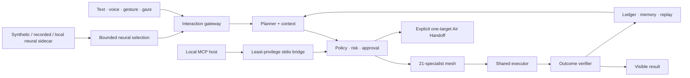

# Heliox OS — AI System Control Agent

<p align="center">
  <a href="https://github.com/VyomKulshrestha/Heliox-OS/releases"></a>
  <a href="https://github.com/VyomKulshrestha/Heliox-OS/releases"></a>
  <a href="https://github.com/VyomKulshrestha/Heliox-OS/actions/workflows/ci.yml"></a>
  <a href="https://github.com/sponsors/VyomKulshrestha"></a>
  <a href="LICENSE"></a>
  <a href="https://olud.ai/tool/vyomkulshrestha-heliox-os.html"></a>
</p>

<p align="center">
  
</p>

<p align="center">
  <strong>Control your computer with natural language, voice, and opt-in gestures.</strong><br>
  Heliox plans supported work, applies permission gates, executes it locally, and verifies the result.
</p>

<p align="center">
  <a href="https://www.helioxos.dev/"><strong>Website</strong></a> •
  <a href="https://github.com/VyomKulshrestha/Heliox-OS/releases"><strong>Download</strong></a> •
  <a href="https://www.helioxos.dev/proof.html"><strong>Evidence</strong></a> •
  <a href="https://www.helioxos.dev/#comparisons"><strong>Compare</strong></a> •
  <a href="docs/SPONSORING.md"><strong>Sponsor</strong></a>
</p>

## What Heliox is

Heliox OS is an MIT-licensed, local-first desktop agent for Windows, macOS, and Linux. It translates typed or spoken requests into validated plans, routes actions to specialist providers, asks before risky or irreversible work, and reports completion only through the guarded execution path.

Heliox is an application that runs on top of an existing operating system; it is not an operating-system kernel. Local-first also does not mean every configuration is offline: cloud models and third-party integrations receive the context required for tasks that use them.

**Name disambiguation:** Heliox OS is this desktop-agent project at `helioxos.dev` and `VyomKulshrestha/Heliox-OS`. It is unrelated to heliox helium-oxygen medical gas and to other products named Heliox, including Heliox IDE.

```text
User intent → Planner → Permission and risk gates → Specialist → Executor → Verifier
                    ↘ durable task state, memory, audit, cancellation and recovery ↗
```

Published release: **v0.12.0** · Python **3.11+** · Windows is the primary hardware-development platform.

v0.12.0 adds subscription-backed Codex and Claude Code model access, local MCP task staging, secure Air Handoff, completed email/calendar/SSH paths, staged neural task launch, and one production cognitive runtime. Provider subscriptions, integrations, hardware inputs, and host actions remain subject to their documented availability and safety boundaries.

## Why Heliox

- **Acts instead of only answering:** supported browser, desktop, file, process, package, Git, integration, screen, and workflow operations enter a real execution path.
- **Verifies instead of assuming:** results pass through executor contracts, and selected actions also have independent post-condition checks.
- **Keeps authority explicit:** five permission tiers, irreversibility flags, per-action approvals, source-scoped gateway policy, cancellation, and fail-closed snapshot requirements bound risky work.
- **Coordinates multiple inputs:** text, continuous voice, gesture, gaze, screen context, and experimental neural intent share one priority-controlled interaction path.
- **Runs locally by default:** the daemon, action execution, preferences, audit stores, and supported local models remain on the user's computer.
- **Exposes evidence:** capability coverage, limitations, benchmark data, CI, release feeds, and machine-readable metadata are public.

<a id="action-catalog"></a>

## Evidence snapshot

| Surface              | Current evidence                                                                              | Important boundary                                                                             |
| -------------------- | --------------------------------------------------------------------------------------------- | ---------------------------------------------------------------------------------------------- |
| Action schema        | 157 declared action types                                                                     | Availability depends on OS, dependencies, permissions, credentials, and policy                 |
| Specialist mesh      | 21 executable specialists with providers for 157/157 declared actions                         | Provider coverage is not universal environment compatibility                                   |
| Outcome verification | 18 actions have an independent observed post-condition verifier                               | The other 139 currently rely on the executor result                                            |
| Guarded fast path    | 26.664 ms median, 30.238 ms p95 across 100 non-LLM CPU-usage iterations; zero model calls     | This is not provider, browser, voice, camera, TTS, neural, or full-workflow latency            |
| Subscription planning | 3/3 fixed Codex CLI cases; 14.708 s median; zero executed or destructive actions             | One account and planning only; not action-execution, Claude, or universal provider evidence     |
| Intent dispatch      | 59/59 curated bounded-intent and ambiguous-fall-through regression cases                     | Fixed corpus; not population-level language-understanding accuracy                            |
| Learned risk model   | 36,000 training and 5,400 temporal-validation samples; 5/5 direction invariants              | Covers 12 coarse disk/process action transitions; deterministic policy remains authoritative  |
| Async responsiveness | 65 heartbeats during a real one-second CPU monitor; 25.470 ms maximum heartbeat interval      | Windows timer granularity and host load apply; this is not UI or hardware-input latency        |
| Plugins              | 6 manifests in the generated public catalog                                                   | Marketplace and local plugins remain capability-constrained                                    |
| CI                   | Python, frontend, visual, Rust, marketplace, and installer gates                              | CI does not prove camera, microphone, speaker, EEG, or human accuracy                          |
| Windows signing      | SignPath test-policy workflow signs and verifies EXE, MSI, and embedded application artifacts | The production certificate is pending; current public installers are not yet production-signed |

> [!IMPORTANT]
> **157/157 provider coverage does not mean 157 independently verified outcomes.** The generated catalog records the provider, permission tier, platform declarations, approval requirements, and verification method for every action.

- [Human-readable evidence and limitations](https://www.helioxos.dev/proof.html)
- [Detailed Markdown evidence](proof.md)
- [Machine-readable capability catalog](capabilities.json)
- [Current-main multi-benchmark evidence bundle](docs/evidence/software-benchmarks-2026-08-27.json)
- [v0.12.0 release benchmark snapshot](docs/evidence/software-benchmarks-2026-08-16.json)
- [Raw subscription-planning evidence](docs/evidence/subscription-planning-codex-2026-08-16.json)
- [Historical guarded fast-path benchmark](docs/evidence/react-latency-2026-08-12.json)
- [Live CI history](https://github.com/VyomKulshrestha/Heliox-OS/actions)
- [Release changelog](changelog.md) and [JSON release feed](releases.feed.json)

## Use-case guides

These pages describe the actual workflow, safety boundary, hardware requirements, and known limitations—not only the feature headline.

| Guide                                                                                            | What it answers                                                                     |
| ------------------------------------------------------------------------------------------------ | ----------------------------------------------------------------------------------- |
| [Voice-controlled desktop automation](https://www.helioxos.dev/voice-control.html)               | Continuous listening, speech, approvals, barge-in, and microphone limits            |
| [Browser and application control](https://www.helioxos.dev/browser-app-control.html)             | Target selection, application discovery, visible actions, and verified outcomes     |
| [Accessibility and hands-free operation](https://www.helioxos.dev/accessibility-hands-free.html) | Alternative input paths, stop controls, and remaining validation needs              |
| [Gesture and gaze control](https://www.helioxos.dev/gesture-gaze-control.html)                   | On-device signals, shared-camera behavior, calibration, and false-positive controls |
| [Autonomous workflows](https://www.helioxos.dev/autonomous-workflows.html)                       | Durable jobs, bounded observe-act-verify loops, and approval boundaries             |
| [Plugin marketplace](https://www.helioxos.dev/plugin-marketplace.html)                           | Moderation, integrity verification, permissions, and constrained execution          |
| [Heliox OS neural intent research](https://www.helioxos.dev/neural-research.html)                | BrainFlow synthetic and recorded EEG evidence; no validated live brain-control claim |
| [Existing AI subscription models](https://www.helioxos.dev/subscription-models.html)            | Official CLI login, model selection, quota evidence, and credential boundaries       |

## Honest comparisons

The comparison pages are dated, source-linked, and explain when another product or deterministic automation is a better choice.

| Comparison                                                                                           | Decision focus                                                              |
| ---------------------------------------------------------------------------------------------------- | --------------------------------------------------------------------------- |
| [Heliox vs Copilot on Windows](https://www.helioxos.dev/heliox-vs-windows-copilot.html)              | Microsoft-integrated assistance versus inspectable cross-platform execution |
| [Heliox vs Open Interpreter](https://www.helioxos.dev/heliox-vs-open-interpreter.html)               | Multimodal desktop companion versus coding-agent harness                    |
| [Heliox vs scripts, macros, and RPA](https://www.helioxos.dev/heliox-vs-traditional-automation.html) | Adaptive interaction versus deterministic repeatability                     |

No comparison declares a universal winner. See the [transparent cost page](https://www.helioxos.dev/cost.html) for software, provider, model-download, and hardware costs.

<a id="jarvis-autonomy"></a>

## Core capabilities

| Capability             | Implemented behavior                                                                                                                                       |
| ---------------------- | ---------------------------------------------------------------------------------------------------------------------------------------------------------- |
| Guarded task execution | Typed plans, source-scoped policy, approvals, cancellation, execution claims, and visible terminal results                                                 |
| Adaptive app tasks     | Bounded observe → act → verify loops with fresh screen evidence, target-window reacquisition, replanning, and no-progress termination                      |
| Continuous voice       | Wake-word and follow-up listening, VAD endpoints, coordinated TTS, barge-in, self-speech suppression, and process-isolated local voice models             |
| Interactive companion  | Can warn, revise, stop, accept spoken or typed corrections, and offer grounded next steps after verified results                                           |
| Local chat sessions    | Separate transcripts and task context with bounded cross-session preference and evidence memory                                                            |
| Gesture and gaze       | 30+ gesture mappings, MediaPipe Tasks 3D landmarks, coarse gaze fusion, calibration, temporal rejection, and opt-in cursor control                         |
| Background workflows   | Durable jobs with pause, resume, cancellation, restart recovery, and guarded autonomous execution                                                          |
| Hybrid risk model      | Deterministic policy plus structured transitions, learned risk, verified failure history, and optional shadow UI-JEPA; learned output can only add caution |
| Bounded learning       | Provenance-aware temporal memory, repeated-evidence promotion, replay, drift detection, and reset controls                                                 |
| Plugin ecosystem       | Reviewed GitHub marketplace, signed local plugins, per-file hashes, capability manifests, and constrained native/WASM brokers                              |
| Neural research        | BrainFlow synthetic, recorded EEG playback, public EEGBCI benchmarking, calibrated SSVEP selection, replay-safe Tier 0/1 goals, and explicit staged autonomous task launch |
| MCP interfaces         | Public read-only documentation MCP plus a local, separately authenticated stdio bridge whose tasks use visible Heliox approvals                           |
| Air Handoff            | Opt-in same-LAN phone pairing and one-target encrypted transfer of a held screenshot, text value, or immutable file snapshot; never a remote-control path |
| Secure integrations    | Settings-managed CalDAV, IMAP/SMTP, and allowlisted SSH connections with secrets kept in the operating-system credential store                            |

## Architecture



The desktop is a Tauri/Svelte application. A local Python daemon owns planning, permissions, specialist routing, execution, verification, durable state, memory, and model adapters. Browser, OS, integration, plugin, and research paths enter the same safety and audit backbone.

- [Architecture and process boundaries](docs/ARCHITECTURE.md)
- [IPC message formats](IPC_MESSAGE_FORMATS.md)
- [Agent development guide](AGENT_DEVELOPMENT_GUIDE.md)

<a id="security"></a>

## Security and privacy

> [!WARNING]
> Heliox can execute code, modify files, control applications, and invoke external services. Do not run it as root or Administrator for ordinary work. Review approval dialogs, keep backups, and treat model output as untrusted until execution evidence confirms the requested result.

Core guarantees:

- Structured schema validation before execution.
- Five permission tiers plus a separate irreversibility flag for effects that snapshots cannot undo.
- Per-action approval for system-modifying, destructive, root-critical, and irreversible work.
- Source-scoped gateway floors that a task override may narrow but cannot widen.
- Snapshot requirements that fail closed when a required backend is unavailable.
- HMAC-chained audit records for elevated permission and gateway decisions.
- Real cancellation of in-flight commands and durable reconciliation after reconnect or restart.
- Learned risk, cognitive estimates, adaptation, and neural input cannot grant permission or remove deterministic warnings.
- OS credential stores for API keys; credentials are never written to `.env` or included in plans.
- Air Handoff is off by default; a paired phone can receive only content explicitly held and dropped to it, never daemon RPC or desktop-control authority.
- Gesture cursor control is off by default and exits on an open palm, stop control, or disabled setting.

| Tier | Level         | Default behavior | Examples                                             |
| ---- | ------------- | ---------------- | ---------------------------------------------------- |
| 0    | Read only     | Auto-execute     | `file_read`, `system_info`, `clipboard_read`         |
| 1    | User write    | Auto-execute     | `file_write`, `clipboard_write`, `env_set`           |
| 2    | System modify | Confirm          | `package_install`, `service_restart`, `wifi_connect` |
| 3    | Destructive   | Confirm          | `file_delete`, `process_kill`, `power_shutdown`      |
| 4    | Root critical | Confirm          | privileged and disk operations                       |

Some lower-tier effects—such as sending email, invoking a remote SSH command, or pushing a commit—are still irreversible and therefore require confirmation.

Read [SECURITY.md](SECURITY.md) for the threat model, rollback boundaries, supervision controls, and responsible disclosure process. Read the [privacy policy](https://www.helioxos.dev/privacy.html) before enabling cloud models or integrations.

<a id="installation"></a>

## Installation

### Download the desktop application

1. Open the [latest GitHub release](https://github.com/VyomKulshrestha/Heliox-OS/releases).
2. Download the package for your system:
   - Windows: `Heliox-OS_<version>_x64-setup.exe` or `.msi`
   - macOS Apple Silicon: `Heliox-OS_<version>_aarch64.dmg`
   - macOS Intel: `Heliox-OS_<version>_x64.dmg`
   - Linux: `.AppImage`, `.deb`, or `.rpm`
3. Install and open Heliox OS.
4. Select a local model, add a provider key, or connect an eligible Codex/Claude Code subscription in Settings.

The desktop application requires Python 3.11 or newer and starts the local daemon automatically. First launch may take longer while Heliox creates its environment and downloads optional components. The UI continues reconnecting during initialization.

Windows installers are not yet production-signed. The SignPath test workflow is validated, but Windows may continue to show reputation warnings until the production certificate is issued and connected to the release workflow.

### Build from source

```bash
git clone https://github.com/VyomKulshrestha/Heliox-OS.git
cd Heliox-OS/daemon
python -m pip install -e ".[all,dev]"
python -m pilot.server
```

In a separate terminal:

```bash
cd Heliox-OS/tauri-app/ui
npm ci
npm run dev
```

To run the native desktop shell:

```bash
cd Heliox-OS/tauri-app
npm install
npm run tauri dev
```

Windows contributors can use `setup.ps1`. See [CONTRIBUTING.md](CONTRIBUTING.md) for platform prerequisites and test commands.

### Connect a local MCP host

Start the Heliox desktop application, then configure an MCP host to launch the
installed `heliox-mcp` command:

```json
{
  "mcpServers": {
    "heliox-local": {
      "command": "heliox-mcp"
    }
  }
}
```

The local server exposes status, capability, task preview, submission, polling,
and cancellation tools. Every submitted action requires visible approval in
Heliox; the MCP client cannot approve its own work. See [MCP interfaces](docs/MCP.md)
for the tool list and security boundary.

## Try these tasks

```text
Show me my system information.
Open an installed application and verify its window appears.
Go to Wikipedia's artificial-intelligence page and summarize the introduction.
Create a Python project with tests and run them.
Monitor CPU usage and alert me above 80%.
List every Python file on my Desktop.
Take a screenshot and read the visible text.
Set my volume to 50%.
```

Risky and irreversible tasks may pause for approval. A completed plan is not by itself proof that the requested environmental outcome occurred.

## Configuration

User configuration is stored at `~/.config/heliox-os/config.toml`. Most settings are also available in the desktop Settings panel.

```toml
[model]
provider = "ollama"          # "ollama", "cloud", or "subscription"
ollama_model = "llama3.1:8b"
cloud_provider = "gemini"    # "gemini", "openai", "openrouter", "claude", or "meta"
cloud_model = ""             # OpenRouter defaults to "openrouter/auto"; try "deepseek/deepseek-v4-pro"
subscription_provider = "codex" # "codex" or "claude"
subscription_model = ""      # blank uses the official CLI default
subscription_timeout_seconds = 120
subscription_max_prompt_chars = 48000

[security]
root_enabled = false
snapshot_on_destructive = true

[vision]
mediapipe_backend = "tasks"
gaze_tracking_enabled = false

[gesture_cursor]
enabled = false

[voice]
tts_engine = "kokoro_tts"
```

OpenRouter uses its OpenAI-compatible endpoint. Settings and first-run setup offer automatic routing, DeepSeek V4 Pro, the latest DeepSeek V4 Flash alias, and other current aliases; an exact OpenRouter catalog model ID can also be entered manually. Provider keys remain in the operating-system credential store.

### Use an existing Codex or Claude subscription

Install and sign in through the provider's official CLI (`codex login` or
`claude auth login`), then choose **Existing AI subscription** in first-run
setup or Settings. Heliox does not copy browser sessions, read OAuth files, or
store these credentials. The CLI runs as a text-only model helper in a sterile
temporary directory; Codex is read-only and ephemeral, while Claude has tools,
browser integration, slash commands, and session persistence disabled. Heliox
still owns schema validation, policy, approval, execution, and verification.
See the official [Codex with ChatGPT plan guide](https://help.openai.com/en/articles/11369540-using-codex-with-your-chatgpt-plan)
and [Claude Code authentication guide](https://code.claude.com/docs/en/authentication)
for provider-owned installation and login requirements.

The provider CLI adds its own instruction overhead. Settings separates the
Heliox prompt estimate from provider-reported input, cached input, uncached
input, and output. Exact repeated requests use Heliox's response cache and do
not consume provider quota. The prompt-context cap prevents unbounded history;
simple deterministic commands continue to use local fast paths with zero model
calls. Subscription allowance and model availability remain governed by the
user's provider plan, not by Heliox.

Run the optional planning-only benchmark from `daemon/` to measure latency,
plan quality, and reported usage without executing any proposed action:

```bash
python benchmarks/subscription_planning_suite.py --provider codex
```

Kokoro, Pocket TTS, gaze, gesture tracking, and the learned-risk model are CPU-capable; CUDA is not required. Kokoro and Pocket synthesis runs in a short-lived worker that remains available for a 10-second speech burst, then exits so PyTorch/CUDA libraries do not stay mapped in the control daemon. Optional models still consume storage, memory, CPU time, and download bandwidth while active.

## Platform and research boundaries

| Surface                 | Current status                                                                                                                             |
| ----------------------- | ------------------------------------------------------------------------------------------------------------------------------------------ |
| Windows 10/11           | Primary development and hardware-validation platform                                                                                       |
| Ubuntu/Debian           | Python/UI CI plus desktop packages; integrations and permissions vary                                                                      |
| macOS                   | Python/UI CI plus desktop packages; permissions and hardware require local validation                                                      |
| Camera gesture and gaze | Automated geometry, calibration, fusion, and false-positive tests; physical accuracy is not established across users and environments      |
| Voice and TTS           | Routing, fallback, interruption, and cancellation tests; microphone accuracy and audible quality require human checks                      |
| Neural intent           | Synthetic BrainFlow and recorded EEG paths are tested. A user may stage up to eight text-authored goals and use calibrated focus/select to launch one through normal autonomous decomposition, specialist routing, permissions, approvals, and verification. No live headset accuracy, unrestricted thought reading, medical use, or physical authority is established. |
| Cognitive HUD           | Behavioural estimates from local interaction signals, not physiological or medical measurements                                            |
| Air Handoff             | Automated pairing, cryptography, replay, expiry, file-snapshot, and browser-receiver tests pass. A real phone, LAN/firewall, QR scan, and mobile download still require a human hardware/network check. |

<a id="troubleshooting"></a>

## Troubleshooting

| Problem                                     | First check                                                                                                    |
| ------------------------------------------- | -------------------------------------------------------------------------------------------------------------- |
| Daemon remains offline                      | Confirm Python 3.11+, inspect `~/.local/state/heliox-os/pilot.log`, and ensure port 8785 is free               |
| Provider key is rejected                    | Re-enter it through Settings and confirm the OS credential store is available; Heliox does not use `.env` keys |
| Voice or camera is unavailable              | Grant OS/WebView permission, select the correct device, and close other applications using that hardware       |
| Installed application is not found          | Use its installed display name; missing or ambiguous application matches fail visibly                          |
| Optional Windows model reports missing DLLs | Install the Microsoft Visual C++ Redistributable and reinstall the relevant daemon extra in 64-bit Python      |

Open a [bug report](https://github.com/VyomKulshrestha/Heliox-OS/issues/new/choose) with the operating system, Heliox version, logs, expected result, and observed result. Hardware-dependent reports should also include the device and environment.

## Documentation

- [Architecture](docs/ARCHITECTURE.md)
- [MCP interfaces and local-host setup](docs/MCP.md)
- [Security policy and threat model](SECURITY.md)
- [Windows signing](docs/WINDOWS_SIGNING.md)
- [Gesture and gaze control](GESTURES.md)
- [Plugin marketplace](docs/PLUGIN_MARKETPLACE.md)
- [Neural intent research controls](docs/NEURAL_INTENT.md)
- [Forensics runbook](docs/FORENSICS_RUNBOOK.md)
- [Contributing](CONTRIBUTING.md)
- [Website agent index](https://www.helioxos.dev/llms.txt) and [repository agent index](llms.txt)
- [CodeMeta](codemeta.json), [citation metadata](CITATION.cff), and [machine-readable releases](releases.json)

### Agent and search discovery

Heliox publishes public, read-only discovery surfaces so search engines and assistants can inspect current capabilities and limitations instead of inferring them from marketing copy:

- [Agent index](https://www.helioxos.dev/llms.txt) and [machine-readable capabilities](https://www.helioxos.dev/capabilities.json)
- [Public OpenAPI document](https://www.helioxos.dev/openapi.json) and [API catalog](https://www.helioxos.dev/.well-known/api-catalog)
- [Read-only documentation MCP manifest](https://www.helioxos.dev/.well-known/mcp.json)
- [Agent skills index](https://www.helioxos.dev/.well-known/agent-skills/index.json)
- [Human evidence center](https://www.helioxos.dev/proof.html), [Markdown evidence](https://www.helioxos.dev/proof.md), and [release feed](https://www.helioxos.dev/releases.json)

These surfaces improve technical discoverability; they do not guarantee search ranking, citations, sponsorship, or funding. External visibility is measured separately through a recurring prompt and index audit.

The public documentation MCP is intentionally unable to control a computer.
Local control uses the separately authenticated stdio bridge documented in
[MCP interfaces](docs/MCP.md), and its work remains approval-gated in the
desktop application.

## Support Heliox

Heliox is free and open source. Sponsorship funds the physical validation that software-only CI cannot provide: microphones, cameras, accessibility devices, EEG acquisition hardware, clean-machine release testing, and cross-platform systems.

- [Sponsor through GitHub Sponsors](https://github.com/sponsors/VyomKulshrestha)
- [Read the funding goals and reporting policy](docs/SPONSORING.md)
- Lend test hardware, contribute code, or publish reproducible hardware results
- Connect the project with accessibility, human-computer interaction, or neurotechnology laboratories

Sponsorship never purchases security exceptions, private user data, approval bypasses, or control over technical results.

## Contributing

1. Read [CONTRIBUTING.md](CONTRIBUTING.md).
2. Choose a [good first issue](https://github.com/VyomKulshrestha/Heliox-OS/issues?q=is%3Aissue+is%3Aopen+label%3A%22good%20first%20issue%22).
3. Review the [Code of Conduct](CODE_OF_CONDUCT.md).
4. Join [GitHub Discussions](https://github.com/VyomKulshrestha/Heliox-OS/discussions).

## License

Heliox OS is available under the [MIT License](LICENSE).
