# Heliox OS Architecture

This document describes the current `main` source runtime (package version
0.13.0). It is an architecture contract, not a roadmap. Exact action values live in
`daemon/pilot/actions.py`; exact RPC handlers live in
`daemon/pilot/server.py`.

## System boundaries

Heliox is split into six trust boundaries:

1. **Tauri desktop shell and Svelte UI** collect explicit text, voice, gesture,
   gaze, camera, and settings input. The UI is not the execution authority.
2. **Python daemon** plans, predicts, authorizes, executes, verifies, records,
   and learns from tasks. It binds to localhost and communicates with the UI by
   authenticated WebSocket RPC.
3. **Constrained child runtimes** execute reviewed native and WebAssembly
   plugins. Evolution candidates run in detached Git worktrees inside a
   prebuilt, network-disabled Docker image.
4. **Least-privileged neural sidecar** owns optional synthetic/playback/
   BrainFlow/LSL acquisition, signal quality, calibration, decoding, and
   consented encrypted raw recording. It authenticates with a separate token
   and can send only bounded observations, stimulus reads, and signed intent;
   it cannot arm, commit, execute, approve, or use the UI credential.
5. **Least-privileged local MCP bridge** runs over stdio for an explicitly
   configured MCP host. It authenticates to the loopback daemon with a rotated
   `mcp_local` token and a nine-method RPC allowlist. It cannot call raw
   execution, confirmation, configuration, credential, or neural methods.
   Submitted work enters the normal daemon path and always pauses for visible
   approval in the desktop UI. The public documentation MCP is a separate,
   read-only website endpoint with no local-daemon credential or control path.
6. **Air Handoff receiver** is an opt-in, same-LAN HTTP surface on a separate
   port from daemon JSON-RPC. A paired phone may poll, download, and acknowledge
   only an explicitly dropped transfer addressed to its device ID. It cannot
   inspect plans, invoke actions, approve tasks, or obtain the desktop RPC
   credential. Transfer metadata and bytes remain application-layer encrypted.

Raw camera frames, audio, hand or face landmarks, screen pixels, and binary
payloads are excluded from the experience and learning stores by default.

## End-to-end task flow

```mermaid
flowchart LR
    Input["Text, voice, gesture, gaze, screen context"] --> Interaction["Observable interaction state"]
    NeuralSource["Synthetic/playback/BrainFlow/LSL"] --> Neurod["neurod: quality, calibration and decode"]
    Neurod --> SignedIntent["Signed, expiring neural intent"]
    SignedIntent --> NeuralGate["Dwell, replay, preview and cancellation gate"]
    NeuralGate --> Interaction
    MCPHost["Local MCP host"] --> MCPBridge["stdio MCP bridge"]
    MCPBridge --> MCPTask["MCP task preview, submit, poll or cancel"]
    MCPTask --> Planner
    Policy --> HandoffDraft["Explicit held screenshot, text, or file snapshot"]
    HandoffDraft --> Phone["One selected paired phone"]
    Interaction --> Ledger["Append-only experience ledger"]
    Ledger --> Context["Temporal context assembler"]
    Context --> Planner["Planner and strategy assignment"]
    Planner --> Prediction["Structured world prediction and optional UI-JEPA"]
    Prediction --> Policy["Deterministic policy, critic, gateway, approval"]
    Policy --> Journal["Durable task journal and execution claim"]
    Journal --> Mesh["Capability-based specialist mesh"]
    Mesh --> Executor["Executor or constrained domain adapter"]
    Executor --> Verify["Environment-state verification"]
    Verify --> Ledger
    Verify --> Adaptive{"Goal complete with evidence?"}
    Adaptive -->|"No; bounded retry"| Context
    Adaptive -->|"Yes"| Result["Result and grounded next suggestions"]
    Ledger --> Learning["Verified online adaptation"]
    Ledger --> Replay["Trace replay and evaluation"]
    Replay --> Strategy["Shadow strategy optimization"]
```

Typed commands and voice commands enter this same path. Long-running browser
and desktop goals may repeat the observation, planning, execution, and
verification segment for at most six rounds per step. The loop stops on
verified completion, a repeated no-progress plan, a denied safety gate,
cancellation, or the round limit.

The ordinary action path is sequential. Parallel branches are allowed only
when a caller explicitly attests that they are independent; fan-out,
delegation depth, cancellation, and resource budgets remain bounded.

All ordinary side effects also share one cooperative execution lease. Neural
acquisition, voice, gesture, gaze, and cancellation remain responsive while an
effect is running. A neural commit does not queue behind another effect and
later execute from a stale preview; it fails closed and must be deliberately
selected again.

Bounded read-only status intents have deterministic local plans. The
`system_health_review` action collects fresh CPU, memory, disk, battery, and
running-process evidence through `psutil`, formats the two most important
observations, and returns a prioritized recommendation without an LLM call or
an OS mutation. It still enters the normal permission, routing, execution,
verification, and result contracts.

### Local MCP task lifecycle

`pilot.mcp_server` uses the official Python MCP SDK over stdio and translates
seven tools into nine allowlisted daemon RPC methods. A submit call returns a
durable task identifier immediately; it never reports submission as execution
success. The host polls status until success, failure, cancellation, or another
terminal state. Task status and cancellation are limited to tasks whose durable
owner is `mcp-local`.

MCP task preview is advisory and side-effect free. Submission replans from
current state and forces every proposed action through the existing visible
confirmation dialog. There is no MCP confirmation primitive, so the calling
model cannot authorize its own effects. Cancellation also resolves a waiting
approval as denied, avoiding an orphaned five-minute confirmation wait.

### Air Handoff lifecycle

Air Handoff is disabled by default. Enabling it starts a dedicated receiver on
the configured high port. A five-minute QR offer carries a high-entropy pairing
secret in the URL fragment, so the secret is not sent as an HTTP request. The
phone and daemon authenticate an ephemeral X25519 exchange and derive keys with
HKDF. The daemon retains its copy of each device secret through the OS keyring;
the browser receiver keeps its credential in that browser's local storage until
the user selects **Forget**. The HTTP receiver is therefore limited to a trusted
LAN; application-layer encryption protects transfer metadata and content but
does not turn the browser bootstrap into a publicly trusted HTTPS origin.

The user then explicitly holds a screenshot, bounded text value, or immutable
snapshot of a selected file. A drop names exactly one paired device, encrypts
metadata and payload with AES-GCM for that device, and expires after ten
minutes. Timestamped, nonce-bound HMAC requests reject replays. Revocation,
acknowledgement, cancellation, expiry, size limits, restrictive browser headers,
and file snapshotting are enforced by the receiver. Gesture control is one-shot
and must be armed in the desktop UI: fist holds, palm/palm-push drops, and
palm-pull cancels; ordinary gesture mappings are otherwise unchanged.

## Intelligence and reliability layers

### 1. Unified experience ledger

`pilot.intelligence.experience` records typed, schema-versioned, append-only
events for observations, intents, plans, predictions, approvals, actions,
verification, corrections, suggestions, learning, and terminal outcomes.
Events carry session, task, user, causal-parent, provenance, confidence, and
privacy metadata. Action idempotency keys prevent a retry from becoming a
second training event or a second side effect.

### 2. Trace replay and evaluation

The evaluation harness exports portable traces and replays them without calling
a model or touching the operating system. It grades actual outcome, safety,
latency, efficiency, and interaction quality. Environment probes and required
state assertions prevent a successful-looking chat response from passing when
the machine state is wrong.

### 3. Durable agent loop

The SQLite task journal persists queued, planning, approval, execution,
verification, interrupted, partial, cancelled, failed, superseded, and
succeeded states. Hashed resume capabilities, durable approvals, optimistic
versions, and per-action execution claims support reconnect and restart
recovery. An interrupted or expired claim is marked uncertain and reconciled;
it is never silently repeated.

The frontend tracks a connection epoch. When the daemon reconnects it rejects
stale pending RPC promises, re-authenticates, and reloads daemon-backed feature
stores so panels do not remain permanently unavailable. A resumed durable task
preserves its real terminal status: failed or interrupted actions cannot be
relabelled as successful, and planning text is never used as a failure result.

### 4. Temporal context and memory

Memory is separated into working, episodic, semantic, and time-bounded fact
layers. Facts retain evidence, provenance, confidence, validity windows,
contradiction history, and retraction state. The context assembler ranks
eligible items by relevance, recency, confidence, provenance, scope utility,
and outcome utility under a strict token budget.

A new chat receives the durable user model and relevant memories, not an
unbounded transcript dump. Memory is advisory: it cannot grant permission or
substitute for current-state observation.

### 5. Companion and interruption coordination

One priority coordinator owns narration, risk warnings, approval speech,
failures, final answers, proactive suggestions, voice replies, and user
barge-in. Only one voice speaks at once. Higher-priority speech preempts lower
priority speech, duplicates are suppressed, and user speech takes ownership of
the channel while the person is talking.

The daemon coordinator covers autonomous completion, cognitive warnings,
continuous voice, and frontend speech RPCs. Browser speech synthesis is a
fallback, not a second narrator.

Pocket and Kokoro synthesis runs in a separate local worker process instead of
loading model runtimes into the control daemon. The worker is reused within a
10-second speech burst so follow-up narration stays responsive, then exits and
releases its PyTorch/CUDA mappings. This keeps the control daemon responsive
before and after speech; the ordinary speech-engine fallback path still applies
if the worker cannot load or synthesize.

`pilot.system.interaction.InteractionRuntime` exposes one state machine for
text and voice: idle, listening, understanding, planning, awaiting approval,
acting, verifying, correcting, speaking, and terminal states. Voice uses the
same `execute` handler as typed input rather than a second planner/executor
implementation. Barge-in stops current speech; speech received while a task is
active becomes an out-of-band correction that cancels the current step and
replans without repeating already verified actions.

Continuous conversation is explicit and bounded. While the listener is on,
complete utterances are eligible for routing without a wake phrase, and a
30-second follow-up window opens after speech completes. The listener is
suppressed while Heliox itself speaks so TTS cannot become a new command.

Recognition uses Faster-Whisper when available, with OpenAI Whisper as the
local fallback. The default `small` model balances desktop latency and
accuracy; users can select the engine, model, and language. Endpointing keeps a
short pre-roll and derives a bounded speech threshold from recent ambient
audio, reducing clipped first syllables and fixed-threshold failures. Settings
also exposes a one-utterance microphone test whose transcript is consumed by
the listener before wake-word, workflow, or command dispatch.

### Model adapters and terminal results

The model router supports local Ollama plus native Gemini and Claude adapters.
OpenAI, OpenRouter, and Meta use the shared OpenAI-compatible chat-completions
adapter. OpenRouter defaults to `openrouter/auto`, accepts an exact catalog
model ID, and exposes DeepSeek V4 Pro and the latest V4 Flash alias in the UI.
API keys are retrieved from the operating-system credential store; provider
authentication, credit, rate-limit, timeout, and service errors are redacted
before they reach the UI.

The separate `subscription` adapter delegates authentication and inference to
an installed official Codex or Claude Code CLI. Heliox never parses or copies
the CLI's OAuth state. Each inference starts in a fresh sterile directory:
Codex is ephemeral with user config/rules ignored and a read-only sandbox;
Claude disables tools, browser integration, slash commands, and session
persistence. Any emitted tool activity is rejected. The returned text still
passes through the ordinary Planner schema, deterministic policy, approval,
Executor, and Verifier; a coding-agent subscription is model access, not a
second execution authority.

Subscription requests reuse the exact-response cache, deduplicate repeated
system content, cap serialized context, and expose provider-reported cached and
uncached token usage separately from the Heliox prompt estimate. Cache hits
record zero provider usage. Calls are stored under a `subscription:*` provider
key with zero estimated API-dollar cost, while per-task token caps still apply.
`benchmarks/subscription_planning_suite.py` runs
fixed, side-effect-free plan evaluations and never validates, approves, or
executes the proposed actions.

Only an explicit `success` terminal status renders as a result. Partial,
blocked, and failed work renders as an error; cancellation, interruption, and
live replanning render as neutral system states. Complex cloud planning has a
bounded 35-second generation budget, while deterministic local status paths do
not wait for model-provider advisory work.

### 6. Hybrid world model

The world-model contract predicts a candidate action's expected state, effects,
uncertainty, evidence, sources, and model version. It combines:

- deterministic policy;
- structured OS, filesystem, process, package, service, browser, and UI
  transition prediction;
- calibrated learned disk/process impact and verified historical failure risk;
- an optional action-conditioned UI-JEPA embedding predictor.

The optional JEPA path stays unavailable when validated weights are not staged
and remains shadow-only unless its artifact records gating validation. Learned
evidence may interrupt or add confirmation but can never remove a deterministic
warning or grant authority.

The camera temporal verifier follows the same rule: MediaPipe must first prove
a hand exists; temporal evidence can only reduce or reject a candidate gesture.

### 7. Verified continuous learning

The River-based online learner consumes only newly inserted ledger events. It
learns suggestion relevance from explicit feedback, transition reliability
from callback-observed non-dry-run outcomes, and coarse routines from
privacy-preserving application/time features. Repeated evidence is required
before promotion.

Bounded replay and ADWIN drift detection decay obsolete behavior. Resetting the
learner creates a checkpoint without rewriting the immutable audit ledger.
Learning can rank suggestions and context, but cannot execute actions, browse
for training data, or weaken policy.

### 8. Strategy evolution

GEPA-style reflection proposes bounded planner, tool-description, recovery,
context, suggestion, and decomposition candidates. Candidates are inert while
they move through isolated replay, safety and regression evaluation, shadow
mode, consented canary, and exact-ID administrator promotion.

At least three matching replay scenarios, 10 non-regressing shadow samples,
five non-regressing canary samples, and zero safety incidents are required.
Automatic promotion is disabled, and rollback restores the prior assignment or
the shipped baseline.

### 9. Capability and plugin security

Marketplace manifests declare exact filesystem roots, network domains,
processes, credentials, clipboard directions, devices, retention, and
destructive authority. Catalog hashes, Ed25519 package signatures, manifest
validation, and installed-manifest equality are prerequisites.

Native Python plugins run in one-shot constrained child processes with a
scrubbed environment and only declared credentials. WebAssembly plugins receive
path-scoped WASI preopens, explicit environment grants, bounded memory and
runtime, and no network by default. Native `plugin_call` and reviewed
`wasm_call` remain distinct execution paths. Destructive plugin tools can run only
through the guarded planner and approval path.

### 10. Evolutionary engineering harness

The improvement harness generates multiple inert patch candidates from a
recorded base commit. Candidates are applied only in detached worktrees and
evaluated in the reviewed `heliox-evolution-runner:0.10.0` image with networking
disabled, a read-only root filesystem, dropped Linux capabilities,
`no-new-privileges`, bounded CPU/memory/PIDs, and no inherited credentials.

There is no host-process fallback or automatic image pull. The harness cannot
modify the installed application, push, release, access release credentials, or
promote code. An exact candidate ID creates evidence for external human review.

### 11. Specialist agent mesh

The daemon registers 21 concrete specialists across 20 gateway roles:

| Domain | Specialists |
|--------|-------------|
| OS and desktop | System, File Operations, Package Management, Service Management, Desktop Automation |
| Development and automation | Code, Git, Workflow Automation |
| Web and integration | Web, Network, Integration, Plugin Runtime |
| Communication | Communication, Email, Calendar, RSS |
| Perception and retrieval | Vision, Monitor, Forensics, Semantic Search |
| Remote systems | SSH |

Communication and Email intentionally share the `comm_agent` gateway identity
but retain distinct provider identities. Provider selection uses exact
capability contracts and callback-observed success and latency with a Bayesian
prior. Narrower scope breaks a quality tie; self-reported quality does not.

Every specialist has action, confirmation, gateway, resource, token, action,
latency, and concurrency contracts. Delegation has maximum depth 3 and fan-out
4, rejects cycles, shares cancellation, and carries bounded context references
and partial results.

The mesh exposes approved plugin tools as guarded external providers for
diagnostics, but does not execute plugin code directly. Plugin calls remain
behind the capability broker and planner approval path.

## Action execution and coverage

`ActionType` declares 157 actions. Startup builds the provider index and the
`agent_mesh_status` RPC reports registered actions, available actions, coverage,
and exact uncovered names. The current contract is 157/157 with zero uncovered
routes.

Most specialists filter a sub-plan and use the shared `Executor`, preserving
validation, Agent Gateway policy, learned-risk checks, audit, approval,
idempotency, cancellation, and verification. Calendar, Email, and SSH use
dedicated adapters with hard domain restrictions. A declared
`AgentCapability` describes routing and resource scope; it is not by itself an
operating-system sandbox.

### Adaptive browser and desktop execution

`AutonomousExecutor` and durable voice/gesture workflows share a bounded
observe → act → verify loop for interactive applications. Each round refreshes
screen context, asks the planner for only the next grounded action or tightly
coupled pair, executes through the normal security path, and verifies the real
environment before continuing. An empty plan is successful only when it
contains an explicit completion claim backed by fresh evidence; exact-text
goals are checked case-sensitively.

UI coordinates must come from a current element-detection result. A placeholder
`(0, 0)` click is resolved through `screen_detect_elements`; a missing or
ambiguous target fails instead of guessing. Three repeats of the same plan and
screen fingerprint stop the loop as no progress.

Native application control carries a target-window identity across rounds.
Before foreground mouse or keyboard input, Heliox re-acquires that window;
background text entry includes `KeyboardParams.window_title` and fails if the
target cannot be focused or its editable text cannot be verified. Application
launch is platform-specific and fail-closed: Windows resolves Start-menu,
App-Paths, PATH, and registered apps; macOS uses Launch Services through
`open -a`; Linux accepts a PATH executable or a verified `gtk-launch` desktop
entry. No launcher reports success merely because a shell command was issued.

### Neural intent research boundary

The optional `pilot-neurod` process is an acquisition and decoder gateway, not
an agent or executor. It supports bounded synthetic, `.npz` playback,
BrainFlow, and named local LSL sources. A subject-calibrated SSVEP baseline
emits only `cancel`, `focus_left`, `focus_right`, `select`, or a compiled safe
goal identifier. Unknown fields, invalid hashes/signatures, NaN/Inf, stale or
future windows, reordered sequences, replayed intent IDs, mismatched sessions
or calibration, poor quality, artifacts, insufficient dwell/confidence/margin,
and source/decoder crashes fail closed.

The UI is the independent authority for calibration start, arming, stimulus
markers, commit, approval, and emergency disarm. A preview has an 800 ms cancel
interval, short expiry, compare-and-set revision, and post-commit cooldown.
Voice or gesture cancellation dominates selection. The resolved canonical
goal—not raw EEG—is evaluated by the OS world model before preview and again
before execution.

`NeuralStreamDescriptorV1.evidence_kind` separates transport from evidence:
`synthetic`, `recorded_eeg`, `live_eeg`, or legacy `unknown`. Validation forbids
playback from claiming live EEG and forbids BrainFlow board `-1` from claiming
live evidence. The separate no-hardware benchmark harness exercises the real
BrainFlow synthetic board and MNE CSP/LDA on PhysioNet EEGBCI recordings; its
held-run predictions reach only the bounded navigation-preview vocabulary.

Dedicated neural UI navigation has no OS side effect. Safe desktop mode maps
through `NeuralGoalRegistry`, whose shipped entries are reversible Tier 0/1
status, calculator, and local-notification actions. The UI may also stage an
explicit text-authored goal under a daemon-owned UUID. Neural focus/select can
launch that exact staged goal through the autonomous decomposer and specialist
orchestrator; the sidecar cannot author or alter it. The autonomous gateway,
normal permission and confirmation policy, durable claim, adapter, audit, and
verification remain authoritative. Physical control, destructive approval,
free-form thought decoding, arbitrary neural command text, and provider
credentials are unavailable.

Raw samples stay inside `neurod` unless a user grants explicit purpose-bound
recording consent. `.neeg` chunks and stimulus markers use AES-256-GCM with a
key in the OS credential store, bounded retention, no overwrite, and optional
separately-consented BIDS/BrainVision export. The daemon audit stores bounded
window/intent/preview/plan/result provenance, never samples or feature vectors.

See [Neural Intent Research Controls](NEURAL_INTENT.md) for the state machine,
source commands, current N0-N3 evidence, and unimplemented N4/N5 boundaries.

## Security decision order

An action is allowed to reach a side-effect adapter only after the applicable
checks:

1. schema and parameter validation;
2. deterministic permission tier and irreversible-action classification;
3. world-model and destructive-critic caution;
4. source-scoped Agent Gateway floor and deny list;
5. explicit user approval when required;
6. snapshot fail-closed check when required;
7. durable execution claim;
8. adapter-level allowlists or plugin capabilities;
9. post-action environment verification and audit.

Per-task scope overrides can only narrow a shipped gateway profile. No learned
model, memory, plugin, strategy candidate, or specialist may widen authority.

## Persistent state

All state is local unless the user explicitly configures an external service:

| State | Purpose |
|-------|---------|
| Experience ledger | Immutable causal intelligence events |
| Task journal | Durable lifecycle, approvals, and action claims |
| Temporal memory | Evidence-backed working, episodic, semantic, and temporal facts |
| Agent mesh database | Verified provider outcomes and routing quality |
| Local chat sessions | Per-chat transcript and active-task metadata in frontend local storage |
| Online learning state | Replay buffer, drift state, and promoted adaptation |
| Strategy archive | Inert candidates, evaluations, assignments, and rollback |
| Evolution archive/worktrees | Isolated engineering candidates and evidence |
| Permission and gateway audit stores | Independent tamper-evident decision chains |
| Neural intent audit | HMAC-chained window, intent, preview, commit, plan, result, disarm, and marker provenance without raw EEG |
| Consented neural recordings | Purpose-bound encrypted local `.neeg` files with expiry and optional BIDS export; absent by default |

API keys live in the operating-system credential store, not in these databases.

## Extension invariants

An agent, action, plugin, model, or strategy is incomplete until it has:

- a validated schema and explicit authority contract;
- a concrete provider or constrained runtime;
- cancellation and terminal-result behavior;
- ledger and audit coverage;
- outcome-based verification;
- replay and negative-path tests;
- user-visible status that reports unavailable or fallback states honestly.

See [SECURITY.md](../SECURITY.md), [IPC_MESSAGE_FORMATS.md](../IPC_MESSAGE_FORMATS.md),
[AGENT_DEVELOPMENT_GUIDE.md](../AGENT_DEVELOPMENT_GUIDE.md), and
[PLUGIN_MARKETPLACE.md](PLUGIN_MARKETPLACE.md) for the detailed contracts.
