# Neural Intent Research Controls

Heliox v0.10.1 contains a research-grade software path for treating a small,
deliberately elicited neural choice as one input modality. It does **not** read
unrestricted thoughts, diagnose a person, certify a brain-computer interface,
or authorize physical equipment. The implemented product boundary is N0-N3:
simulator/acquisition, observe-only decoding, safe UI navigation, and a fixed
set of reversible Tier 0/1 desktop goals. A user may also stage an explicit
text-authored autonomous goal, then use neural focus/select to launch that
specific goal through Heliox's normal decomposition and specialist-agent
pipeline. This is selection of prior text, not free-form thought decoding.

Physical neural control is disabled in code. N4 physical proposal shadow mode
and N5 physical research pilots remain future work and require independent
hardware-in-the-loop, human-factors, electrical-safety, and emergency-stop
evidence.

## Authority and data flow

```mermaid
flowchart LR
    Source["Synthetic, playback, BrainFlow, or local LSL"] --> Neurod["Least-privileged neurod sidecar"]
    Neurod --> Quality["Bounded buffer, quality and artifact rejection"]
    Quality --> Decoder["Subject-calibrated SSVEP decoder"]
    Decoder --> Intent["Signed, expiring NeuralIntentV1"]
    Intent --> Fusion["Voice, gesture and gaze cancellation context"]
    Fusion --> Preview["Visible preview and cancel interval"]
    Preview --> World["Hybrid OS world-model caution"]
    World --> Gate["Deterministic policy and neural source profile"]
    Gate --> Lease["Shared execution lease"]
    Lease --> Effect["Dedicated UI navigation or fixed Tier 0/1 goal"]
    Effect --> Audit["Window to intent to preview to result provenance"]
```



Raw sample windows stay inside `neurod`. The daemon receives a bounded quality
summary, stimulus markers, and signed intent envelopes. Raw EEG is written only
when the user explicitly enables recording. It is never sent to an LLM by this
path.

The sidecar authenticates with a token distinct from the UI token and is
restricted to seven neural RPC methods. Only the UI may begin calibration,
arm control, commit a preview, or write stimulus markers. Only one sidecar may
own the active session. A sidecar disconnect disarms the controller.

## Implemented sources

| Source | Intended use | Boundary |
|--------|--------------|----------|
| Synthetic | Deterministic CI, UI development, soak and fault tests | Explicitly labelled `synthetic`; not biological EEG |
| Playback `.npz` | Reproducible offline windows | Explicitly labelled `recorded_eeg`; does not validate a live headset or user |
| BrainFlow | Synthetic board `-1` plus supported physical boards | Synthetic board is labelled `synthetic`; physical boards require runtime and calibration |
| Local LSL | Interoperation with a named local Lab Streaming Layer stream | Requires `pylsl` and a working platform `liblsl` runtime |

The `neural` package extra installs BrainFlow, MNE, and pylsl:

```bash
cd daemon
python -m pip install -e ".[neural]"
```

The desktop's normal `all` installation includes this extra. If a native board
or LSL runtime is absent, that selected source fails visibly; it never falls
back to synthetic data.

## Run the zero-hardware paths

Start the daemon and desktop application, then open **Settings -> Neural Intent
Research Controls**. A prominent photosensitivity warning must be accepted
before the SSVEP stimulus or sidecar can start.

For a direct developer run:

```bash
cd daemon
pilot-neurod --source synthetic --synthetic-frequency 12
```

The daemon writes the short-lived sidecar token under the local runtime
directory with user-only permissions where the OS supports them. Synthetic
mode creates a deterministic, content-addressed calibration artifact. Live and
playback modes require an explicit artifact:

```bash
pilot-neurod --source playback --playback session.npz --artifact calibration.json
pilot-neurod --source brainflow --board-id 0 --serial-port COM3 --artifact calibration.json
pilot-neurod --source lsl --lsl-name HelioxEEG --artifact calibration.json
```

Do not interpret a successful synthetic run as evidence of human SSVEP
accuracy. Browser/WebView stimulus markers use a daemon-received monotonic
timestamp and are suitable for product integration testing, but they are not a
sub-millisecond laboratory trigger.

Settings also contains a **No-hardware validation** panel. The equivalent
developer commands are:

```bash
# Actual BrainFlow driver and synthetic board; generated data, not EEG accuracy
pilot-neurod-benchmark brainflow-synthetic --seconds 2

# Public recorded EEG, downloaded on demand by MNE
pilot-neurod-benchmark eegbci --subject 1 --runs 6 10 14
```

The EEGBCI benchmark follows MNE's open motor-imagery CSP example: 7-30 Hz
filtering, one-second imagery epochs, four-component CSP, and LDA. Heliox uses
leave-one-run-out evaluation rather than overlapping random windows and maps
held-run predictions only to the bounded `focus_left` and `focus_right`
preview vocabulary. Dataset files stay in MNE's user cache and are never
committed to the repository.

- [MNE motor-imagery CSP example](https://mne.tools/stable/auto_examples/decoding/decoding_csp_eeg.html)
- [PhysioNet EEG Motor Movement/Imagery Dataset](https://physionet.org/content/eegmmidb/1.0.0/)

On 2026-08-12, the checked developer run for EEGBCI subject 1, runs 6/10/14,
produced 45 recorded epochs and **95.54% held-run balanced accuracy** against a
**53.33% majority-class baseline**. This is a reproducibility snapshot for one
public recorded subject, not a claim about a live Heliox user or headset.

## Calibration and decoding

The first decoder is an inspectable SSVEP correlation baseline. Calibration:

- uses complete held-out blocks rather than overlapping random windows;
- requires every registered target in every block;
- records balanced accuracy, expected calibration error, and per-class recall;
- binds channel order, sampling rate, window length, target frequencies, and
  subject pseudonym into a content-addressed artifact; and
- rejects an artifact whose hash, source metadata, or inference shape differs.

Signal analysis detects saturation, flat channels, packet loss, clock faults,
line noise, and high-amplitude blink/muscle/motion-like contamination. A poor
or artifact-flagged window abstains. It is not silently cleaned and described
as good EEG.

The decoder emits only `cancel`, `focus_left`, `focus_right`, `select`, or a
compiled `safe_goal` identifier. Natural-language strings from a sidecar never
become commands or action parameters.

## Intent gate

The state machine is:

```text
disconnected -> connected_uncalibrated -> calibrating -> observe_only
  -> armed_safe_ui or armed_safe_desktop
  -> candidate_intent -> previewed -> committed/abstained -> cooldown
```

Arming requires a calibrated active session and an explicit non-neural UI
action. Each intent must have:

- schema version 1 with unknown fields rejected;
- a valid session HMAC and matching session/calibration/subject;
- strictly increasing sequence and a never-before-seen intent UUID;
- monotonic evidence timestamps, a short expiry, and a current state revision;
- good signal quality with no artifact flags;
- at least 75% posterior, a 15% class margin, and three agreeing dwell windows;
- scope no wider than the current arming scope; and
- a class present in the compiled local allow-list.

The preview remains non-executable for 800 ms, expires with the signed intent,
uses compare-and-set revision at commit, and enters a one-second cooldown after
commit. Cancel, a simultaneous voice/gesture cancellation, disconnect, clock
rollback, stale data, a decoder/source failure, or world-model unavailability
disarms or rejects the path.

## Effect boundary

Dedicated neural UI mode can move focus left/right and select in the neural
control surface. Safe desktop mode can select only these compiled goals:

- system, CPU, memory, battery, process, window, and volume status;
- open the OS calculator; and
- show a local break reminder.

The UI can additionally stage up to eight explicit autonomous goals. Each
staged goal is authored non-neurally, shown in the neural control surface, and
identified by an opaque daemon-owned task UUID. Neural input can focus and
select that card; it cannot supply or modify the goal text, action parameters,
agent assignment, permission scope, or approval state. A successful selection
submits the staged goal to the standard autonomous engine, which decomposes
complex work, routes each resulting action plan through registered specialist
agents, executes under the ordinary autonomous gateway ceiling, verifies
postconditions, and reports progress. Normal confirmations still apply to
later actions. Staging or selecting a task is not blanket approval.

Every goal is checked at construction to be reversible and Tier 0 or Tier 1.
The `neural` Agent Gateway profile cannot be widened by a caller. The resolved
plan is assessed by the world model before preview and again immediately before
commit. A warning requires a separate UI approval; repeating a neural class is
not approval. The shared executor still applies schemas, deterministic policy,
gateway checks, durable claims, adapters, audit, and result verification.

Ordinary effects coordinate through one cooperative execution lease. A neural
commit never waits behind an already-running effect and then executes a stale
preview: it fails closed. Acquisition and cancel/disarm signals remain live
while another feature holds the lease.

Physical goals, destructive approval, root authority, arbitrary neural command
text, provider secrets, and continuous cursor/robot motion are not capabilities
of the neural sidecar or gate.

## Recording and BIDS export

Raw recording is off by default and requires an explicit purpose, expiry,
retention period of 1-365 days, and a new `.neeg` destination. Every sample
chunk and stimulus marker is encrypted independently with AES-256-GCM. The key
is stored in the OS credential store; recording fails closed when secure key
storage is unavailable. Files are never overwritten, and expired recordings
are removed before a new recording starts; cleanup failure blocks the new
recording.

BIDS export is separately consented. It creates a new BIDS/BrainVision dataset
containing channel metadata, samples, and synchronized stimulus events:

```bash
pilot-neurod-export session.neeg new-bids-dataset
```

Export refuses an existing destination and rejects an unauthenticated or
tampered encrypted record.

## Audit and privacy

The daemon maintains an append-only HMAC chain containing bounded metadata for
accepted intents, previews, commits, effects, results, disarms, and stimulus
markers. It links the evidence window, intent UUID, preview UUID, and plan ID.
Raw samples, feature vectors, face/hand landmarks, frames, audio, and screen
pixels are excluded.

The recording key and the audit-chain key are separate. The sidecar token is
also distinct from the UI token. Pseudonymous subject keys are accepted; names
and email addresses do not belong in the neural protocol.

## Current verification evidence

Automated coverage includes strict parser validation, malformed/stale/future/
replayed envelopes, bounded buffers, source crashes, dropped packets, playback
rebasing, evidence-provenance enforcement, real BrainFlow synthetic-board
acquisition, LSL chunk accumulation, grouped EEGBCI classification and bounded
preview mapping, calibration holdout rules, signal artifacts,
world-model refusal, cancel/commit races, role separation, sidecar disconnect,
record encryption/tampering/retention/export, stimulus markers, audit-chain
tampering, the shared execution lease, explicit task staging, neural task
selection, autonomous submission, specialist routing, and a real two-WebSocket
sidecar/UI end-to-end flow.

A deterministic synthetic soak covers 7,200 observations over a simulated
hour with zero emitted intents. This proves the registered synthetic fixture
does not create control, not a biological false-activation rate.

| Roadmap gate | Software status | Evidence still required |
|--------------|-----------------|-------------------------|
| N0 contract and simulator | Implemented and automated | None for the software boundary |
| N1 observe-only live EEG | Acquisition/recording/export/decoder software implemented | Real OpenBCI session, multi-day replay, biological artifact and calibration evidence |
| N2 safe UI navigation | Implemented and paired-RPC tested | Representative human no-control soak and physical keyboard/mouse emergency-disarm exercise |
| N3 desktop goals and staged autonomous launch | Implemented and guarded-path tested | Real-user latency, fatigue, cross-session, voice/gaze/gesture coexistence validation |
| N4 physical shadow proposal | Not implemented | HIL simulator, physical world model, deterministic supervisor and independent stop evidence |
| N5 physical research pilot | Not implemented | Qualified safety/ethics/human-factors review and on-site operator controls |

No public claim should call N1-N3 physically validated until those hardware
and human tests are recorded. Classification accuracy alone is not a release
gate; false committed actions, abstention, latency, recovery, comfort, and
cross-session degradation matter more.

## Source map

| Surface | Location |
|---------|----------|
| Contracts and state gate | `daemon/pilot/neural/protocol.py`, `gate.py` |
| Sources, quality, calibration, decoder | `acquisition.py`, `quality.py`, `decoder.py`, `service.py` |
| Least-privilege bridge | `rpc_client.py`, `security/rpc_identity.py` |
| Heliox controller, fixed goals, provenance | `controller.py`, `goals.py`, `audit.py` |
| Consented recording/export | `recording.py` |
| No-hardware benchmarks | `benchmark.py` (`pilot-neurod-benchmark`) |
| Desktop lifecycle | `tauri-app/src-tauri/src/commands.rs` (`start_neural_sidecar`, `stop_neural_sidecar`, export/status) |
| Settings, stimulus and preview UI | `NeuralControlPanel.svelte`, `SSVEPStimulusGrid.svelte`, `NeuralControlOverlay.svelte` |
| UI state | `tauri-app/ui/src/lib/stores/neural.ts` |
